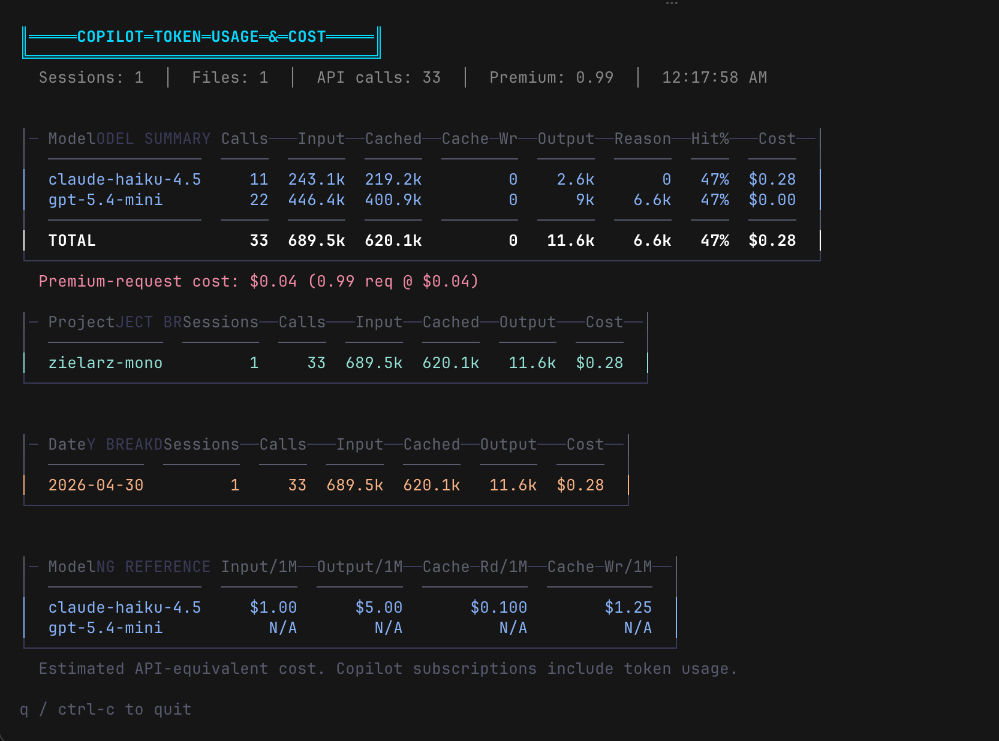

# copilot-token-counter

> [!IMPORTANT]
> **Canonical repository.** This is the canonical home of the project. The later
> [`pc-style/copilot-tokens`](https://github.com/pc-style/copilot-tokens) experiment is archived and retained for reference.

## Problem and solution

GitHub Copilot CLI records token metrics locally, but does not provide a compact
terminal view of usage across sessions. `copilot-token-counter` reads those local
session events and displays per-model, per-project, and daily totals in a live TUI.

It also calculates an **estimated API-equivalent cost** from the bundled pricing
snapshot. That estimate is a comparison aid, not a Copilot bill: Copilot plans,
premium-request accounting, and current provider prices may differ.

## Demo



## Install

Requires [Bun](https://bun.sh) and Git. The installer clones this repository to
`~/.copilot-token-counter`, installs dependencies, and creates
`~/.local/bin/copilot-tokens`.

```sh
curl -fsSL https://raw.githubusercontent.com/pc-style/copilot-token-counter/main/install.sh | sh
```

Review [`install.sh`](./install.sh) before piping it to a shell. To choose other
locations, set `COPILOT_TOKEN_COUNTER_DIR` and/or `BIN_DIR`.

## Trust and privacy

- The TUI reads `~/.copilot/session-state/*/events.jsonl` on the local machine.
- The application contains no telemetry or session-data upload code.
- Running the installer contacts GitHub, and `bun install` contacts the configured
  package registry to obtain dependencies.
- Session files can contain project paths, repository names, model names, and usage
  metrics. The TUI displays some of that information; take care when sharing output
  or screenshots.
- Cost figures use the static [`pricing.json`](./pricing.json) snapshot, whose source
  note is dated February 2026. Verify current pricing before relying on an estimate.

## Status and scope

This is the canonical repository and the only repository in this pair intended for
future changes. It is a small, local, terminal-only tool provided as-is. There are
no published releases and no promise that undocumented Copilot CLI event schemas
will remain compatible.

## License

[MIT](./LICENSE) © 2026 pc-style.

## Provenance and related repository

This repository was created on May 3, 2026. The separate
[`pc-style/copilot-tokens`](https://github.com/pc-style/copilot-tokens) repository
was created on May 4, 2026 as a later alternate implementation and is now archived.

The archived implementation regex-scans `~/.copilot/logs/process-*.log` and adds
custom log/session paths, a configurable refresh interval, recent-call output,
section visibility settings, and parser tests. Those features remain available in
its history but were not copied here: this implementation deliberately keeps its
structured `events.jsonl` parser and OpenTUI interface. The archived README credits
[ekroon's Copilot token cost gist](https://gist.github.com/ekroon/424b81ebca907b5e5de3ce07a649da5e)
for that implementation's log-parsing approach.

## Usage

```sh
copilot-tokens
```

Press `q` or `Ctrl-C` to exit.

## Run from source

```sh
git clone https://github.com/pc-style/copilot-token-counter.git
cd copilot-token-counter
bun install
bun start
```

## How it works

For every session file under `~/.copilot/session-state/<id>/events.jsonl`:

- `session.shutdown` events provide aggregated per-model input, output, cache-read,
  cache-write, and reasoning-token usage.
- For a session still in progress, `assistant.message` events provide live output
  tokens and request counts. Full input and cache totals appear after shutdown.
- `session.start` supplies the date and project context used for grouping.

New bytes are tailed on `fs.watch` notifications with a one-second polling safety
net for filesystems where append events do not fire reliably.
